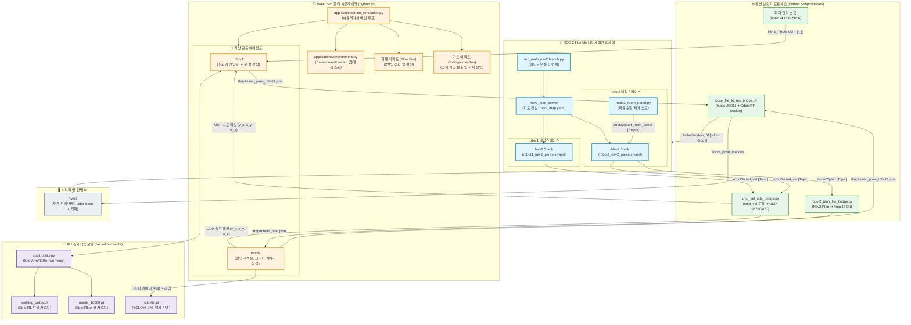

# ① 전체 시스템 아키텍처 다이어그램 (Overall System Architecture Diagram)

본 다이어그램은 **Isaac Sim 시뮬레이터**, **ROS 2 Humble Nav2 내비게이션 스택**, **AI/RL 제어 모델**, 그리고 이들 사이의 데이터 통신을 매핑하는 **Python 브릿지 프로세스** 간의 전체적인 상호작용 및 물리적/논리적 아키텍처를 보여줍니다.

### 📋 주요 구성 요소 설명

1.  **Isaac Sim 시뮬레이터 (`main_simulation.py`)**: 
    물리 엔진을 구동하고 3D 환경을 렌더링하는 핵심 시뮬레이션 환경입니다. `EnvironmentLoader`를 통해 소화기(Cube), 가상 조난자(Person1, Person2) 및 건물을 생성합니다. 또한 Flow 기술을 기반으로 10초 후에 화재(Fire)를 점화하고, 소화기가 바닥에 닿으면 가스(ExtinguisherGas)를 분출하는 물리/이펙트 처리를 담당합니다.
2.  **가상 로봇 에이전트 (`spot_agent.py`)**:
    시뮬레이션 내부의 로봇 인스턴스(`robot1`, `robot2`)로, 강화학습 보행 엔진(`spot_policy.py`) 및 센서 데이터를 관리합니다.
    -   `robot1`: 로봇 팔이 장착된 에이전트로 소화기 자동 파지(Grasp), 이동, 투척(Throw)을 수행합니다.
    -   `robot2`: 그리퍼 카메라(RGB-D)를 장착한 에이전트로 방 순찰 및 YOLOv8 인명 탐지를 수행합니다.
3.  **통신 브릿지 프로세스**:
    Isaac Sim(윈도우/리눅스 내부 파이썬 환경)과 ROS 2 Humble(우분투 ROS 환경) 간의 이기종/비표준 통신 인터페이스를 연결하기 위한 백그라운드 Python 스크립트 모음입니다. UDP 패킷 전송 및 파일 I/O 방식을 사용하여 ROS 2의 내비게이션 명령과 Isaac Sim의 가상 물리 좌표를 실시간 매핑합니다.
4.  **ROS 2 Humble 내비게이션**:
    *   역할: 멀티 로봇의 자율주행을 담당하며, 네임스페이스(`robot1`, `robot2`) 분할 설정을 적용하여 하나의 공통 지도(`map_server`) 위에서 두 대의 로봇이 서로 다른 경로 계획(Global/Local Planner)을 독립적으로 수립할 수 있도록 제어합니다.
5.  **관제 UI (RViz2)**:
    *   ROS 2 환경에서 로봇의 실시간 Lidar 스캔 데이터, 맵 정보, 내비게이션 경로 계획 및 마커(`MarkerArray`)를 하나의 화면에 가시화하여 모니터링할 수 있도록 돕습니다.

---

### 🛠️ 주요 트러블슈팅 사례 (Troubleshooting)

1. **외부 매쉬 맵 로딩 시 물리 충돌 누락 문제**
   - **문제 상황**: 시뮬레이션 환경에 외부에서 제작한 USDZ 맵을 불러왔을 때, 눈에 보이기만 할 뿐 물리적인 충돌 속성이 부여되지 않아 로봇이 바닥을 뚫고 추락하는 문제가 발생했습니다.
   - **해결책**: 이를 해결하기 위해 `applications/environment.py` 스크립트를 수정했습니다. 맵이 로드될 때 `apply_map_collisions` 파트를 통해 맵의 모든 매쉬를 탐색하고, 런타임에 물리 API를 강제로 적용하여 충돌체(Collision body)를 생성하도록 설계하여 해결했습니다.

2. **Nav2 코스트맵 튜닝 - 맵 좌표계 불일치**
   - **문제 상황**: 시뮬레이션 월드의 좌표계와 `nav2_map.png` 이미지 간의 좌표가 서로 맞지 않아 네비게이션이 엉뚱한 곳을 향하는 현상이 있었습니다.
   - **해결책**: 코드 상에서 복잡한 좌표 변환 로직을 새로 짜는 대신, 아주 직관적이고 가벼운 방식으로 해결했습니다. 바로 코스트맵 이미지 자체를 180도 회전시켜 적용함으로써, 두 환경 간의 정합성을 완벽하게 맞췄습니다.
