# ② 쉘 스크립트 실행 파이프라인 흐름도 (Execution Stage Pipeline Flowchart)

본 다이어그램은 `run_stage1.sh`부터 `run_stage5.sh`까지 순차적으로 각 쉘 스크립트 단계를 실행함에 따라, 시스템 내부의 컴포넌트가 어떻게 활성화되고 로봇의 조작 방식이 확장되는지 보여주는 파이프라인 흐름도입니다.

```mermaid
flowchart TD
    %% 스타일 정의
    classDef stage fill:#ede7f6,stroke:#5e35b1,stroke-width:2px;
    classDef comp fill:#fff3e0,stroke:#ff9800,stroke-width:1px;
    classDef active fill:#e8f5e9,stroke:#43a047,stroke-width:2px;
    classDef verify fill:#eceff1,stroke:#607d8b,stroke-width:1px;

    %% Stage 1
    subgraph STAGE1["🌱 Stage 1: 로봇 기본 동작 확인"]
        direction TB
        S1["run_stage1.sh 실행"]:::stage
        C1_1["Isaac Sim 물리 월드 생성<br>(main_simulation.py)"]:::comp
        C1_2["robot1, robot2 스폰"]:::comp
        C1_3["robot1 수동 키보드 제어<br>(방향키 전진/회전)"]:::comp
        C1_4["ROS2 내비게이션 기동<br>(run_multi_nav2.launch.py)"]:::comp
        
        S1 --> C1_1 --> C1_2 --> C1_3 --> C1_4
        
        V1["🔍 검증:<br>- 맵에 로봇 2대 렌더링 확인<br>- 키보드 방향키 조작 확인<br>- RViz2에 Lidar 스캔 데이터 표출"]:::verify
        C1_4 --> V1
    end

    %% Stage 2
    subgraph STAGE2["🔥 Stage 2: 화재 효과 및 수동 조작"]
        direction TB
        S2["run_stage2.sh 실행"]:::stage
        C2_1["화재 시뮬레이션 이펙트 가동<br>(10초 점화 / 15초 확산)"]:::comp
        C2_2["소화기 에셋 스폰"]:::comp
        C2_3["robot1 수동 조작 키 바인딩<br>(G키: 파지, Q키: 투척)"]:::comp
        C2_4["소화기 바닥 충돌 센서 감지<br>(소화 가스 분출 및 화재 진압)"]:::comp

        S2 --> C2_1 --> C2_2 --> C2_3 --> C2_4
        
        V2["🔍 검증:<br>- 10초 후 점화 콘솔 출력 확인<br>- G키/Q키 조작을 통한 소화기 파지/투척<br>- 바닥 충돌 시 가스 이펙트 방출"]:::verify
        C2_4 --> V2
    end

    %% Stage 4
    subgraph STAGE4["👤 Stage 4: 인명 탐지 카메라 연동"]
        direction TB
        S4["run_stage4.sh 실행"]:::stage
        C4_1["조난자 에셋 배치<br>(Person1, Person2 스폰)"]:::comp
        C4_2["robot2 그리퍼 카메라 활성화<br>('robot2 Gripper View' 윈도우 생성)"]:::comp
        C4_3["yolov8n.pt YOLOv8 추론 활성화<br>(인명 탐지 모델 로드)"]:::comp
        C4_4["조난자 탐지 및 정렬 상태 모니터링<br>(ALIGNING ➔ APPROACHING)"]:::comp

        S4 --> C4_1 --> C4_2 --> C4_3 --> C4_4
        
        V4["🔍 검증:<br>- 조난자 캐릭터 스폰 확인<br>- 그리퍼 카메라 뷰 창 생성<br>- YOLOv8 기반 사람 바운딩 박스 확인"]:::verify
        C4_4 --> V4
    end

    %% Stage 5
    subgraph STAGE5["🤖 Stage 5: 완전 자동화 시나리오 (최종)"]
        direction TB
        S5["run_stage5.sh 실행"]:::stage
        
        subgraph AUTO_R1["robot1: 화재 진압 자동 루프"]
            AR1["화재 감지 ➔ 소화기 위치로 자율이동 (Nav2)<br>➔ 자동 파지 (Grasp) ➔ 화재 위치로 자율이동<br>➔ 자동 투척 (Throw) ➔ 출구로 탈출 (EXIT)"]:::active
        end
        
        subgraph AUTO_R2["robot2: 자율 순찰 및 구조 자동 루프"]
            AR2["자율 순찰 기동 (5➔1➔3➔4➔6번방)<br>➔ YOLO 사람 감지 시 순찰 즉시 중단<br>➔ 사람 접근 ➔ 출구로 유도 (Escort)<br>➔ 안전 탈출 완료 (EXIT)"]:::active
        end

        S5 --> AUTO_R1 & AUTO_R2
        
        V5["🔍 검증:<br>- 사람이 개입하지 않는 완전 자동화 시나리오<br>- 화재 진압 및 조난자 구조 성공 여부<br>- 로봇 2대 모두 안전하게 집 밖으로 탈출"]:::verify
        AUTO_R1 & AUTO_R2 --> V5
    end

    %% 스테이지 간 파이프라인 전이 관계
    STAGE1 -- "화재 이펙트 & 수동 Grasp 추가" --> STAGE2
    STAGE2 -- "인명 탐지 모델 & 사람 스폰 추가" --> STAGE4
    STAGE4 -- "Nav2와 에이전트 상태머신 통합" --> STAGE5
```

### 📋 단계별 실행 정보 및 파라미터 매핑

*   **Stage 1 (`run_stage1.sh`)**:
    *   **역할**: 시뮬레이터와 ROS 2 브릿지 간의 기본적인 양방향 통신(cmd_vel 및 TF/Odom 피드백)을 수립합니다.
    *   **실행**: `python.sh applications/main_simulation.py` (Isaac Sim 기동) 및 `ros2 launch run_multi_nav2.launch.py` (ROS2 내비게이션 기동).
*   **Stage 2 (`run_stage2.sh`)**:
    *   **역할**: 맵에 소화기(`Cube`)가 추가되며 물리 법칙과 타이머에 따른 화재 발생 이벤트를 검증합니다.
    *   **동작**: 10초 후에 `applications/main_simulation.py` 내의 `_create_flow_fire` 에 emitter를 변경하여 `[🔥 점화]` 콘솔을 띄우고, 15초에 `[🔥 확산]`을 처리합니다.
*   **Stage 4 (`run_stage4.sh`)**:
    *   **역할**: YOLOv8 탐지 파이프라인을 기동합니다.
    *   **동작**: 조난자 거리 계산(Raycast 연동) 및 탐지 마진 설정을 위한 쉘 환경 변수들을 내보냅니다.
        *   `COBOT_PERSON_ALIGN_TOLERANCE=0.10`
        *   `COBOT_PERSON_APPROACH_DISTANCE=1.15`
        *   `COBOT_PERSON_APPROACH_MIN_TIME=0.8`
        *   `COBOT_PERSON_APPROACH_TIMEOUT=8.0`
        *   `COBOT_PERSON_FOLLOW_DISTANCE=2.4`
*   **Stage 5 (`run_stage5.sh`)**:
    *   **역할**: 완전 자동화 시나리오를 통합 검증하는 최종 런타임 단계입니다.
    *   **동작**: 로봇 2대의 각 자동화 상태머신이 활성화되며, 서로 다른 임무(진압 vs 순찰/구조)를 동시에 독자적으로 연계 수행합니다. 최종적으로 두 로봇이 모두 집 밖 탈출 지점(`EXIT_POS` = `(1.568, 20.041)`)에 도달하여 시뮬레이션이 안전하게 자동 정지(Timeline Pause)됩니다.
