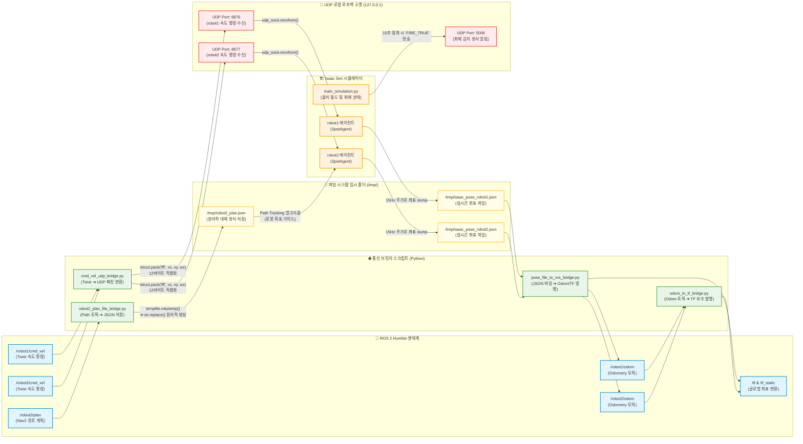

# ③ 통신 브릿지 네트워크 다이어그램 (Network & Bridge Communication Diagram)

본 다이어그램은 ROS 2 Humble 노드들과 Isaac Sim 시뮬레이션 프로세스가 UDP 통신 및 임시 파일 I/O 시스템을 매개로 데이터를 실시간으로 중계하는 데이터 전송 아키텍처를 세밀하게 나타냅니다.

### 📡 브릿지별 통신 프로토콜 상세 설명

1.  **속도 명령 브릿지 (`cmd_vel_udp_bridge.py`)**:
    *   **통신 방식**: ROS 2 토픽 구독 ➔ UDP 패킷 전송 (Socket)
    *   **메커니즘**: ROS 2의 `geometry_msgs/msg/Twist` 형태의 주행 속도 명령 토픽(`/{namespace}/cmd_vel`)을 구독하여 선속도(x, y) 및 각속도(z) 정보를 파싱합니다. 파이썬 `struct.pack('fff', msg.linear.x, msg.linear.y, msg.angular.z)` 함수를 사용해 **12바이트** 크기의 이진 데이터로 압축하고, UDP 소켓을 통해 시뮬레이터 내부 로봇에 해당하는 포트(`9876` / `9877`)로 실시간 포워딩합니다.
2.  **좌표 피드백 브릿지 (`pose_file_to_ros_bridge.py`)**:
    *   **통신 방식**: 파일 I/O (JSON) ➔ ROS 2 토픽 및 TF 변환 발행
    *   **메커니즘**: Isaac Sim 환경 내의 로봇들은 15Hz 속도로 본인의 글로벌 물리 좌표 및 Orientation(쿼터니언) 정보를 `/tmp/isaac_pose_robotX.json` 파일에 JSON 포맷으로 지속 기록(dump)합니다. ROS 2 환경에 실행된 브릿지 노드는 이 파일을 주기적으로 파싱하여 ROS 2 표준 `nav_msgs/msg/Odometry` 메시지 및 TF 좌표 변환 정보(`map ➔ robotX/odom ➔ robotX/body`)를 글로벌 `/tf` 토픽에 생성하고 배포합니다.
3.  **경로 추적 브릿지 (`robot2_plan_file_bridge.py`)**:
    *   **통신 방식**: ROS 2 토픽 구독 ➔ 파일 I/O (JSON)
    *   **메커니즘**: Nav2 스택이 계산한 로봇의 전역 경로 정보(`nav_msgs/msg/Path`)인 `/{namespace}/plan` 토픽을 구독하여 모든 웨이포인트 좌표를 추출합니다. 파일 동시 쓰기로 인한 깨짐 문제를 예방하기 위해 먼저 임시 경로에 JSON을 작성(`tempfile.mkstemp`)한 뒤, 완성된 파일을 원자적 파일 교체 명령(`os.replace`)을 사용해 `/tmp/{namespace}_plan.json`으로 교체 저장합니다. Isaac Sim의 순찰 로봇은 이 파일을 읽어 경로 추적(Path Tracking) 제어에 적용합니다.
4.  **화재 센서 통신**:
    *   **통신 방식**: UDP 소켓 송신
    *   **메커니즘**: 시뮬레이션 러너는 물리 루프 중 화재가 정상 점화(`elapsed_time > 10.0`)되면 로컬 포트 `5006`번으로 `"FIRE_TRUE"` UDP 바이트 데이터를 지속적으로 브로드캐스팅하여, 외부 대시보드나 관제 인터페이스가 화재 상태를 탐지할 수 있도록 유도합니다.
