# ④ 멀티 로봇 Nav2 노드 및 TF 트리 아키텍처 (Multi-Robot Nav2 & TF Tree Architecture)

본 다이어그램은 `run_multi_nav2.launch.py` 실행 시 생성되는 멀티 로봇 시스템의 **독립적인 네임스페이스 분리 구조**와 **공유 맵 서버**, 그리고 이들의 상대 좌표계를 정의하는 **TF(Transform) 트리 아키텍처**를 보여줍니다.

```mermaid
flowchart TD
    %% 스타일 정의
    classDef global fill:#eceff1,stroke:#607d8b,stroke-width:2px;
    classDef robot1 fill:#e3f2fd,stroke:#1e88e5,stroke-width:2px;
    classDef robot2 fill:#fff3e0,stroke:#fb8c00,stroke-width:2px;
    classDef tfNode fill:#f1f8e9,stroke:#7cb342,stroke-width:1px;
    classDef file fill:#fffde7,stroke:#fbc02d,stroke-width:1px;

    %% 1. 글로벌 공유 영역
    subgraph GLOBAL["🌐 글로벌 공유 리소스 및 노드 (Global Context)"]
        MS["map_server<br>(nav2_map_server)"]:::global
        LM_MAP["lifecycle_manager_map<br>(맵 서버 생명주기 관리)"]:::global
        MAP_YAML["nav2_map.yaml / .png<br>(공동 2D 그리드 지도 파일)"]:::file
        
        MS --- MAP_YAML
        LM_MAP -.-> |"구동 상태 트리거"| MS
    end

    %% 2. robot1 네임스페이스 그룹
    subgraph NS_R1["🤖 robot1 네임스페이스 그룹 (GroupAction)"]
        direction TB
        N_NAV1["navigation_launch.py<br>(Nav2 자율주행 노드 컨테이너)"]:::robot1
        P_YAML1["robot1_nav2_params.yaml<br>(robot1 전용 주행 파라미터)"]:::file
        
        TF_M2O_1["static_tf_map_to_odom_r1<br>(네임스페이스 TF 리매핑)"]:::robot1
        TF_B2L_1["static_tf_body_to_lidar_r1<br>(네임스페이스 TF 리매핑)"]:::robot1

        N_NAV1 --- P_YAML1
    end

    %% 3. robot2 네임스페이스 그룹
    subgraph NS_R2["🤖 robot2 네임스페이스 그룹 (GroupAction)"]
        direction TB
        N_NAV2["navigation_launch.py<br>(Nav2 자율주행 노드 컨테이너)"]:::robot2
        P_YAML2["robot2_nav2_params.yaml<br>(robot2 전용 주행 파라미터)"]:::file
        
        TF_M2O_2["static_tf_map_to_odom_r2<br>(네임스페이스 TF 리매핑)"]:::robot2
        TF_B2L_2["static_tf_body_to_lidar_r2<br>(네임스페이스 TF 리매핑)"]:::robot2

        N_NAV2 --- P_YAML2
    end

    %% 4. 글로벌 TF 정적 변환 노드 (tf2_ros)
    subgraph TF_STATIC_PUBS["🔌 글로벌 static_transform_publisher 노드"]
        direction TB
        STF1["map ➔ robot1/odom"]:::tfNode
        STF2["robot1/body ➔ robot1/Functional_Lidar"]:::tfNode
        STF3["map ➔ robot2/odom"]:::tfNode
        STF4["robot2/body ➔ robot2/Functional_Lidar"]:::tfNode
    end

    %% 5. TF 트리 구조 시각화 (Hierarchy)
    subgraph TF_TREE["🌳 최종 통합 TF 트리 (RViz2 조회 기준)"]
        direction TB
        T_MAP["map<br>(기준 원점)"]:::tfNode
        
        T_O1["robot1/odom<br>(로봇1 가상 원점)"]:::robot1
        T_B1["robot1/body<br>(로봇1 베이스 좌표)"]:::robot1
        T_L1["robot1/Functional_Lidar<br>(로봇1 라이다 센서 위치)"]:::robot1
        
        T_O2["robot2/odom<br>(로봇2 가상 원점)"]:::robot2
        T_B2["robot2/body<br>(로봇2 베이스 좌표)"]:::robot2
        T_L2["robot2/Functional_Lidar<br>(로봇2 라이다 센서 위치)"]:::robot2

        %% 트리 구조 연결
        T_MAP ===> |"정적 변환 (0,0,0)"| T_O1
        T_MAP ===> |"정적 변환 (0,0,0)"| T_O2
        
        T_O1 ===> |"동적 변환 (Pose Bridge)"| T_B1
        T_O2 ===> |"동적 변환 (Pose Bridge)"| T_B2
        
        T_B1 ===> |"정적 높이 변환 (z=0.25)"| T_L1
        T_B2 ===> |"정적 높이 변환 (z=0.25)"| T_L2
    end

    %% 연결 관계 매핑
    MS --> |"/map 토픽 발행"| N_NAV1 & N_NAV2
    STF1 -.-> T_O1
    STF2 -.-> T_L1
    STF3 -.-> T_O2
    STF4 -.-> T_L2
```

### 📋 주요 설계 세부사항

1.  **독립 네임스페이스 및 파라미터 분할 (`PushRosNamespace`)**:
    *   두 대의 로봇이 단일 ROS 2 환경 내에서 노드 이름이나 토픽 충돌 없이 병렬 자율주행을 수행할 수 있도록, 각각 `robot1` 및 `robot2` 네임스페이스 그룹으로 완전히 분리하여 가동합니다.
    *   각 로봇 그룹은 서로 다른 파라미터 파일(`robot1_nav2_params.yaml`, `robot2_nav2_params.yaml`)을 로드하여 독립적인 로컬 플래너(DWA/TEB 등) 및 Costmap 크기를 개별 설정할 수 있습니다.
2.  **공유 자원 (`map_server`)**:
    *   공동의 환경 레이아웃인 `nav2_map.yaml` 정보를 발행하는 단일 `map_server` 노드를 기동하고, `/robot1/map` 및 `/robot2/map` 토픽으로 맵 데이터를 각각 공급하여 동일한 공간 정보 위에서 경로 탐색을 하도록 유도합니다.
3.  **이중화된 TF(Transform) 구조의 이유**:
    *   **네임스페이스 내부 TF**: Nav2 시스템 내부는 자신의 리매핑된 로컬 TF 큐인 `tf`/`tf_static` 상에서만 길을 찾습니다. 이를 위해 각 GroupAction 내에서 리매핑을 적용한 정적 변환기들을 구동합니다.
    *   **글로벌 TF**: RViz2 등 단일 시각화 도구에서 두 대의 로봇을 하나의 월드 상에 동시에 올리기 위해, 글로벌 `/tf` 토픽으로도 정적 링커(`map ➔ robotX/odom`, `robotX/body ➔ robotX/Functional_Lidar`)를 배포합니다.
4.  **동적 링커 (`pose_file_to_ros_bridge.py`)**:
    *   정적으로 연결되지 않는 `robotX/odom ➔ robotX/body` 구간의 상대 거리 및 회전값은 브릿지 노드가 파일에서 실시간 좌표를 읽어 동적 TF 변환으로 채워줌으로써, 최종적으로 `map ➔ odom ➔ body ➔ lidar`에 이르는 완전한 좌표계 체인이 끊기지 않고 동작하도록 돕습니다.
