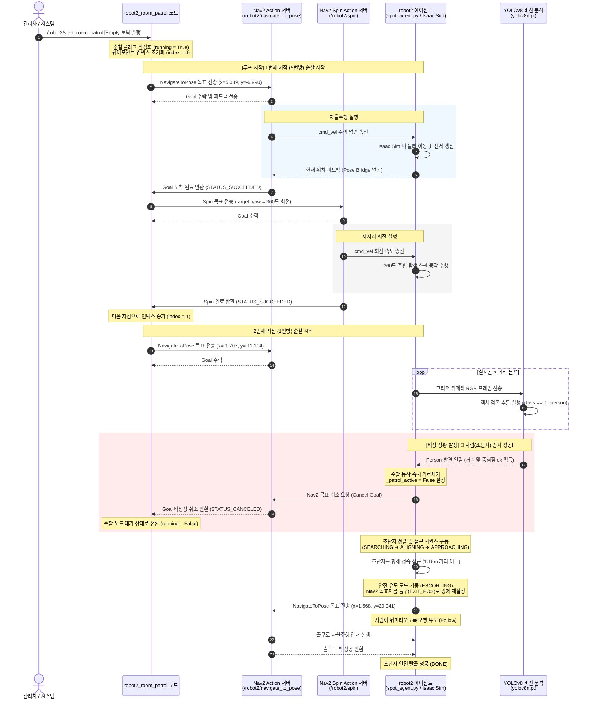

# ⑤ 로봇 정찰/순찰 임무 시퀀스 다이어그램 (Room Patrol Mission Sequence Diagram)

본 다이어그램은 `robot2_room_patrol.py` 노드가 시작 신호를 받아 정해진 방들을 순찰하는 일련의 자율주행/제자리 회전 시퀀스와, 순찰 도중 YOLOv8 카메라를 통해 조난자를 감지했을 때 순찰 노드 제어권을 가로채고 인명 구조 모드로 급격히 전환되는 비상 흐름을 시퀀스 다이어그램으로 나타냅니다.

### 📋 시퀀스 세부 동작 설명

1.  **순찰 시작 트리거**:
    *   사용자가 `/robot2/start_room_patrol` Empty 메시지를 발행하면 `Robot2RoomPatrol` 클래스의 콜백 함수 `_on_start`가 호출되면서 시작됩니다.
2.  **동작-회전 연계 제어**:
    *   로봇은 방 번호 순서(`5번방 ➔ 1번방 ➔ 3번방 ➔ 4번방 ➔ 6번방`)대로 목표 지점을 순회합니다.
    *   목표 지점에 도착(액션 성공)하면, 로봇은 방 내부의 사각지대를 수색하기 위해 `/robot2/spin` 액션을 통해 **제자리에서 시계 방향으로 360도 회전(target_yaw = 2 * pi)**을 수행한 후 다음 방으로 이동합니다.
3.  **YOLOv8 비전 분석에 의한 중단 (Interrupt)**:
    *   자율주행 중인 로봇의 카메라 프레임 분석 스레드(`_run_yolo_step`)에서 사람 클래스(`person`)가 임계 확률(`COBOT_YOLO_CONF` = 0.35) 이상으로 감지되면 순찰 시퀀스가 비상 중단됩니다.
    *   `spot_agent.py`는 액션 클라이언트에 직접 취소 명령을 내려 Nav2 주행을 강제 중단시키고, 로봇은 기존 순찰 경로를 이탈하여 조난자 대피 가이드 모드로 돌입합니다.

---

### 🛠️ 주요 트러블슈팅 사례 (Troubleshooting)

1. **Nav2 액션 서버 먹통 및 통신 명령 유실**
   - **문제 상황**: 시뮬레이션 환경의 부하나 네트워크 지연으로 인해 Nav2 액션 서버가 먹통이 되거나 이동 명령 자체가 유실되는 상황이 발생했습니다.
   - **해결책**: 이를 해결하기 위해 `applications/spot_agent.py` 스크립트에 `_nav_goal_retry` 로직을 구현했습니다. 명령이 유실되거나 주행 반응이 없다고 판단되면 시스템이 자동으로 목표 지점을 재전송(Retry)하게 만들어 통신 신뢰성을 완벽히 확보했습니다.

