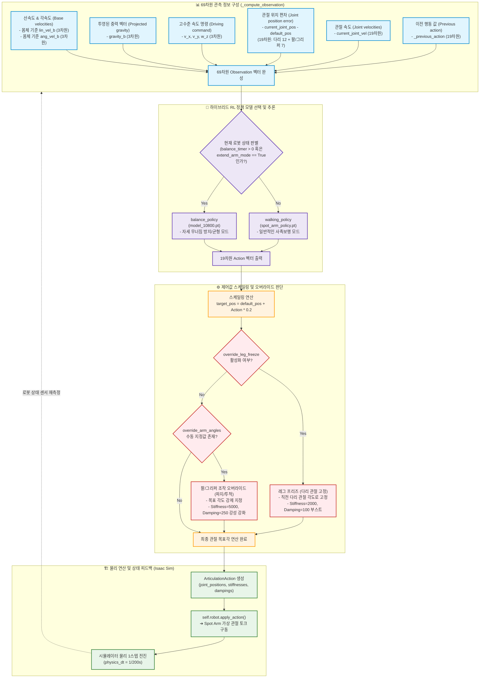

# ⑥ Spot Arm RL Policy 루프 플로우차트 (Spot Arm Policy Action-State Loop)

본 다이어그램은 `spot_policy.py` 내의 `SpotArmFlatTerrainPolicy` 제어기에서 실행되는 **강화학습(RL) 기반의 보행 및 균형 제어 루프**와 고수준 동작 시의 **관절 값 강제 지정(Joint Override)** 메커니즘을 상세히 도식화합니다.

### 📋 강화학습 제어 사이클 설명

1.  **관측(Observation) 벡터 구성**:
    *   로봇 몸체(Base) 프레임의 선속도와 각속도, 중력 투영 벡터, ROS 2 브릿지로부터 전송받은 외부 속도 명령, 19개 관절의 위치 오차 및 속도, 직전 제어기 출력 등 총 **69차원**의 정보로 상태 벡터를 조립하여 정책 신경망의 입력으로 제공합니다.
2.  **하이브리드 정책 신경망 (Hybrid Policy)**:
    *   **보행 정책 (`walking_policy`)**: 로봇의 안정적인 보행을 전담합니다.
    *   **균형 정책 (`balance_policy`)**: 몸체의 기울어짐 각도가 임계치(`TILT_SLOWDOWN_RAD` = 14도)를 넘거나 급격히 넘어지는 조짐이 감지되면 보행 정책 대신 동작하여 전도되지 않도록 제어합니다.
3.  **다리 고정 제어 (`override_leg_freeze`)**:
    *   로봇이 멈춰 서서 물건을 집거나 던질 때, 다리가 흔들려 딥러닝 기반 파지 작업이 실패하는 것을 방지하기 위해 다리 관절의 Stiffness를 2000으로 강화하고 관절 각도를 잠금 처리하여 기저부를 단단하게 고정합니다.
4.  **관절 오버라이드 및 강성 강화 (Grasp & Throw Override)**:
    *   소화기를 잡거나 던지는 순간에는 RL 보행 정책에 의해 제어되던 팔 관절을 임시 해제하고, 기하학적 픽앤플레이스 알고리즘에 의해 계산된 목표 관절 위치(`override_arm_angles` 6개, `override_grip_angle` 1개)를 강제로 적용합니다. 
    *   이때 소화기를 들고 있는 동안 발생하는 물리적 부하에 버티기 위해 팔 관절 강성 제어값(Stiffness/Damping)을 평상시보다 강한 **5000 / 250** 수준으로 급격히 부스팅합니다.
