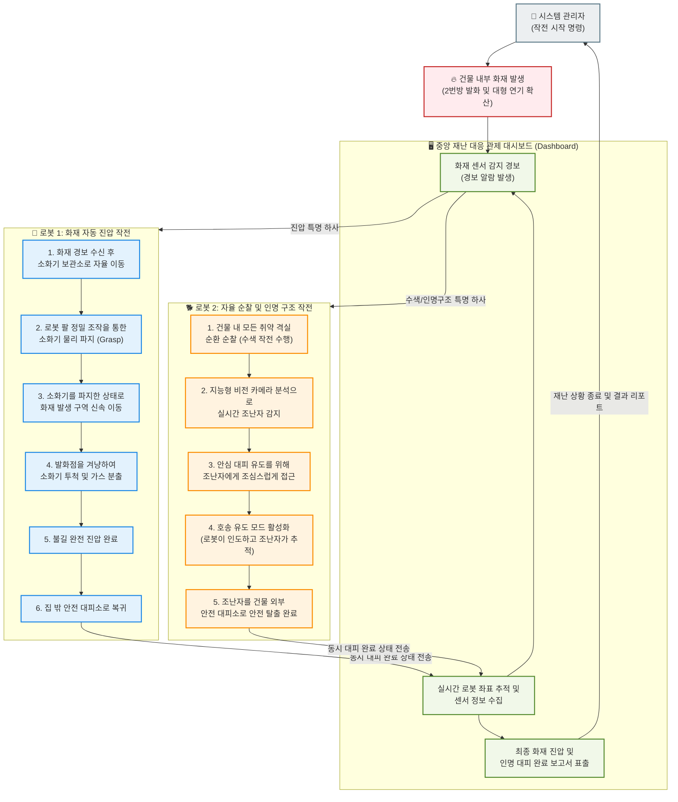

# ⑧ 전체 서비스 시나리오 플로우차트 (End-to-End Service Scenario Flowchart)

본 다이어그램은 복잡한 ROS 2 토픽이나 코드 변수명을 제외하고, 비개발자(기획자, 채용 담당자, 클라이언트 등)가 프로젝트의 실질적인 비즈니스 가치와 서비스 시나리오("화재 감지-자동 진압-조난자 수색-안전 대피 유도-통합 관제")를 직관적으로 파악할 수 있도록 서비스 흐름을 나타낸 흐름도입니다.

### 💼 비즈니스 시나리오 가치 흐름

1.  **재난 상황 감지 (Dashboard)**:
    *   중앙 관제소는 평시 상황에서 건물 내부에 배치된 두 대의 로봇 위치를 3D 지도로 실시간 모니터링합니다. 화재 센서가 발화 온도에 도달하면 대시보드에 즉시 시각 및 청각 경보가 울리고 각 로봇에게 비상 제어 명령을 전달합니다.
2.  **화재 조기 진압 성공 (로봇 1)**:
    *   로봇 1은 화재 현장으로 직접 뛰어들기 전, 현장에 배치된 소화기를 스스로 찾아가 로봇 팔을 이용해 단단히 움켜쥡니다. 소화기를 파지한 로봇 1은 위험한 화재 영역으로 진입하여 적절한 거리에서 소화기를 정확하게 투척하여 가스 방출을 유도, 대형 화재로 번지는 것을 물리적으로 조기 진압하고 대피소로 복귀합니다.
3.  **조난자 무사 구출 (로봇 2)**:
    *   화재로 인한 연기와 장애물이 늘어나는 최악의 상황 속에서, 로봇 2는 격실을 차례로 자율 수색합니다. 카메라 영상을 기반으로 숨어있는 조난자를 식별해 낸 로봇 2는 조난자가 안심하고 따라올 수 있도록 천천히 다가가 출구 방향으로 비상 유도 자율주행을 실행합니다. 조난자를 안전지대까지 가이드하여 소중한 생명을 무사히 구출합니다.
4.  **관제 종결 및 보고**:
    *   대시보드는 소화 성공 정보와 조난자의 대피 완료 이벤트를 자동으로 판정 및 수집하여 관리자에게 "재난 통제 완료 및 인명 구조 100% 완료" 보고서를 출력함으로써 재난 상황을 평화롭게 종료합니다.
