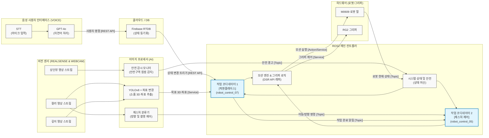

# 로봇 시스템 통신 아키텍처 (ROS2 Communication Diagram)

제공해주신 레퍼런스 이미지를 바탕으로, 현재 프로젝트(인생두컷)의 전체 통신 아키텍처를 표현한 다이어그램입니다. 메인 컨트롤러인 `robot_control_07.py`와 `robot_control_node_05.py`가 2개의 핵심 마더보드(Coordinator) 역할을 수행하는 구조를 명확히 담았습니다.

