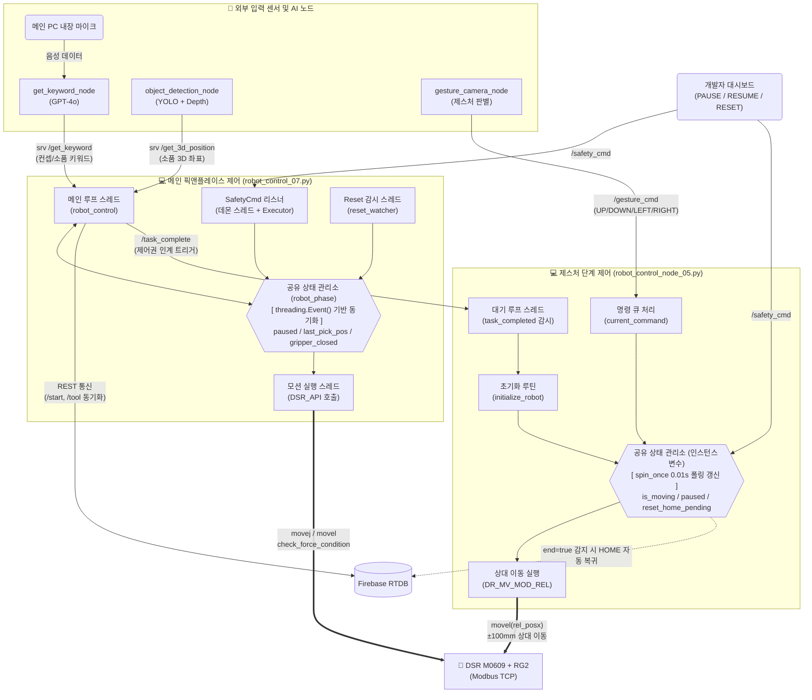

# 메인 컨트롤러 마더보드 플로우차트

두 개의 핵심 메인 컨트롤러 노드(`robot_control_07.py` 및 `robot_control_node_05.py`)가 내부적으로 어떻게 멀티스레딩 상태 관리를 수행하고, 외부 입출력과 상호작용하는지를 마더보드(Motherboard) 아키텍처 관점에서 표현한 통합 플로우차트입니다.

```mermaid
flowchart TD
    %% 외부 센서 및 보조 노드
    subgraph SENSORS["🎤 외부 입력 센서 및 AI 노드"]
        MIC("메인 PC 내장 마이크")
        GET_KW["get_keyword_node\n(GPT-4o)"]
        OBJ_DET["object_detection_node\n(YOLO + Depth)"]
        GES_CAM["gesture_camera_node\n(제스처 판별)"]
    end
    
    MIC -- "음성 데이터" --> GET_KW

    %% 첫 번째 마더보드: 메인 픽앤플레이스 제어기
    subgraph BOARD1["💻 메인 픽앤플레이스 제어 (robot_control_07.py)"]
        direction TB
        B1_MAIN["메인 루프 스레드\n(robot_control)"]
        B1_SAFE["SafetyCmd 리스너\n(데몬 스레드 + Executor)"]
        B1_RST["Reset 감시 스레드\n(reset_watcher)"]
        B1_MOT["모션 실행 스레드\n(DSR_API 호출)"]
        
        B1_STATE{{"공유 상태 관리소 (robot_phase)\n[ threading.Event() 기반 동기화 ]\npaused / last_pick_pos / gripper_closed"}}
        
        B1_MAIN <--> B1_STATE
        B1_SAFE --> B1_STATE
        B1_RST --> B1_STATE
        B1_STATE --> B1_MOT
    end

    %% 두 번째 마더보드: 제스처 단계 제어기
    subgraph BOARD2["💻 제스처 단계 제어 (robot_control_node_05.py)"]
        direction TB
        B2_WAIT["대기 루프 스레드\n(task_completed 감시)"]
        B2_INIT["초기화 루틴\n(initialize_robot)"]
        B2_CMD["명령 큐 처리\n(current_command)"]
        B2_MOT["상대 이동 실행\n(DR_MV_MOD_REL)"]
        
        B2_STATE{{"공유 상태 관리소 (인스턴스 변수)\n[ spin_once 0.01s 폴링 갱신 ]\nis_moving / paused / reset_home_pending"}}
        
        B2_WAIT --> B2_INIT
        B2_INIT --> B2_STATE
        B2_CMD --> B2_STATE
        B2_STATE --> B2_MOT
    end

    %% 외부 인프라 및 로봇 하드웨어
    DASH("개발자 대시보드\n(PAUSE / RESUME / RESET)")
    FB[("Firebase RTDB")]
    ROBOT["🦾 DSR M0609 + RG2\n(Modbus TCP)"]

    %% 컴포넌트 간 연결 관계
    GET_KW -- "srv /get_keyword\n(컨셉/소품 키워드)" --> B1_MAIN
    OBJ_DET -- "srv /get_3d_position\n(소품 3D 좌표)" --> B1_MAIN
    
    DASH -- "/safety_cmd" --> B1_SAFE
    DASH -- "/safety_cmd" --> B2_STATE
    
    B1_MAIN -- "REST 통신\n(/start, /tool 동기화)" --> FB
    
    B1_MAIN -- "/task_complete\n(제어권 인계 트리거)" --> B2_WAIT
    
    GES_CAM -- "/gesture_cmd\n(UP/DOWN/LEFT/RIGHT)" --> B2_CMD
    
    B2_STATE -. "end=true 감지 시 HOME 자동 복귀" .-> FB
    
    B1_MOT == "movej / movel\ncheck_force_condition" ==> ROBOT
    B2_MOT == "movel(rel_posx)\n±100mm 상대 이동" ==> ROBOT
```
