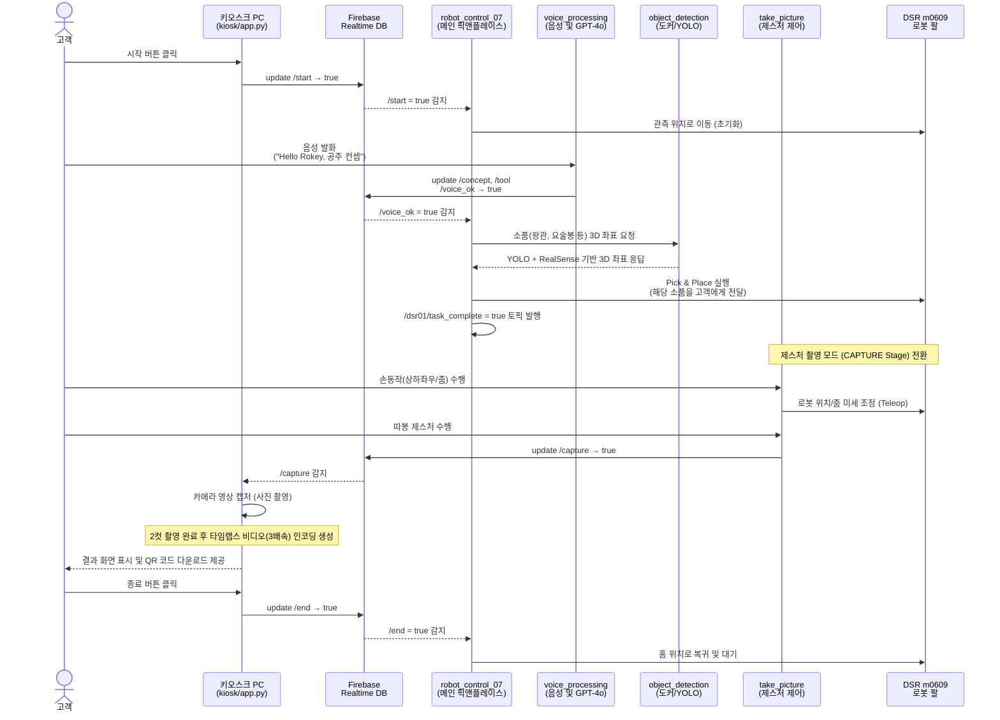

# 인생두컷 시스템 시퀀스 다이어그램

```mermaid
sequenceDiagram
    actor 고객
    participant KIOSK as 키오스크 PC<br/>(kiosk/app.py)
    participant FB as Firebase<br/>Realtime DB
    participant RC as robot_control_07<br/>(메인 픽앤플레이스)
    participant VP as voice_processing<br/>(음성 및 GPT-4o)
    participant OD as object_detection<br/>(도커/YOLO)
    participant GES as take_picture<br/>(제스처 제어)
    participant DSR as DSR m0609<br/>로봇 팔

    고객->>KIOSK: 시작 버튼 클릭
    KIOSK->>FB: update /start → true

    FB-->>RC: /start = true 감지
    RC->>DSR: 관측 위치로 이동 (초기화)

    고객->>VP: 음성 발화<br/>("Hello Rokey, 공주 컨셉")
    VP->>FB: update /concept, /tool<br/>/voice_ok → true

    FB-->>RC: /voice_ok = true 감지
    RC->>OD: 소품(왕관, 요술봉 등) 3D 좌표 요청
    OD-->>RC: YOLO + RealSense 기반 3D 좌표 응답

    RC->>DSR: Pick & Place 실행<br/>(해당 소품을 고객에게 전달)
    RC->>RC: /dsr01/task_complete = true 토픽 발행

    Note over GES, DSR: 제스처 촬영 모드 (CAPTURE Stage) 전환
    
    고객->>GES: 손동작(상하좌우/줌) 수행
    GES->>DSR: 로봇 위치/줌 미세 조정 (Teleop)
    
    고객->>GES: 따봉 제스처 수행
    GES->>FB: update /capture → true

    FB-->>KIOSK: /capture 감지
    KIOSK->>KIOSK: 카메라 영상 캡처 (사진 촬영)
    
    Note over KIOSK: 2컷 촬영 완료 후 타임랩스 비디오(3배속) 인코딩 생성
    
    KIOSK-->>고객: 결과 화면 표시 및 QR 코드 다운로드 제공
    
    고객->>KIOSK: 종료 버튼 클릭
    KIOSK->>FB: update /end → true
    
    FB-->>RC: /end = true 감지
    RC->>DSR: 홈 위치로 복귀 및 대기
```
