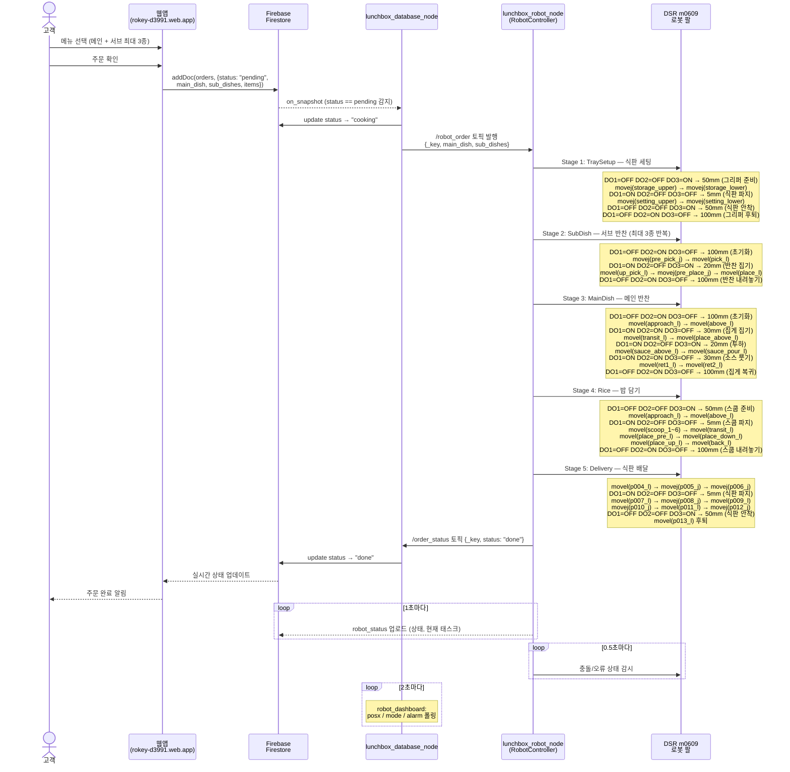

# 주문 처리 시퀀스 다이어그램

```mermaid
sequenceDiagram
    actor 고객
    participant WEB as 웹앱<br/>(rokey-d3991.web.app)
    participant FS as Firebase<br/>Firestore
    participant DB as lunchbox_database_node
    participant RC as lunchbox_robot_node<br/>(RobotController)
    participant DSR as DSR m0609<br/>로봇 팔

    고객->>WEB: 메뉴 선택 (메인 + 서브 최대 3종)
    고객->>WEB: 주문 확인
    WEB->>FS: addDoc(orders, {status: "pending",<br/>main_dish, sub_dishes, items})

    FS-->>DB: on_snapshot (status == pending 감지)
    DB->>FS: update status → "cooking"
    DB->>RC: /robot_order 토픽 발행<br/>{_key, main_dish, sub_dishes}

    RC->>DSR: Stage 1: TraySetup — 식판 세팅
    Note over DSR: DO1=OFF DO2=OFF DO3=ON  → 50mm (그리퍼 준비)<br/>movej(storage_upper) → movej(storage_lower)<br/>DO1=ON  DO2=OFF DO3=OFF → 5mm  (식판 파지)<br/>movej(setting_upper) → movej(setting_lower)<br/>DO1=OFF DO2=OFF DO3=ON  → 50mm (식판 안착)<br/>DO1=OFF DO2=ON  DO3=OFF → 100mm (그리퍼 후퇴)

    RC->>DSR: Stage 2: SubDish — 서브 반찬 (최대 3종 반복)
    Note over DSR: DO1=OFF DO2=ON  DO3=OFF → 100mm (초기화)<br/>movej(pre_pick_j) → movel(pick_l)<br/>DO1=ON  DO2=OFF DO3=ON  → 20mm (반찬 집기)<br/>movel(up_pick_l) → movej(pre_place_j) → movel(place_l)<br/>DO1=OFF DO2=ON  DO3=OFF → 100mm (반찬 내려놓기)

    RC->>DSR: Stage 3: MainDish — 메인 반찬
    Note over DSR: DO1=OFF DO2=ON  DO3=OFF → 100mm (초기화)<br/>movel(approach_l) → movel(above_l)<br/>DO1=ON  DO2=ON  DO3=OFF → 30mm (집게 집기)<br/>movel(transit_l) → movel(place_above_l)<br/>DO1=ON  DO2=OFF DO3=ON  → 20mm (투하)<br/>movel(sauce_above_l) → movel(sauce_pour_l)<br/>DO1=ON  DO2=ON  DO3=OFF → 30mm (소스 붓기)<br/>movel(ret1_l) → movel(ret2_l)<br/>DO1=OFF DO2=ON  DO3=OFF → 100mm (집게 복귀)

    RC->>DSR: Stage 4: Rice — 밥 담기
    Note over DSR: DO1=OFF DO2=OFF DO3=ON  → 50mm (스쿱 준비)<br/>movel(approach_l) → movel(above_l)<br/>DO1=ON  DO2=OFF DO3=OFF → 5mm  (스쿱 파지)<br/>movel(scoop_1~6) → movel(transit_l)<br/>movel(place_pre_l) → movel(place_down_l)<br/>movel(place_up_l) → movel(back_l)<br/>DO1=OFF DO2=ON  DO3=OFF → 100mm (스쿱 내려놓기)

    RC->>DSR: Stage 5: Delivery — 식판 배달
    Note over DSR: movel(p004_l) → movej(p005_j) → movej(p006_j)<br/>DO1=ON  DO2=OFF DO3=OFF → 5mm  (식판 파지)<br/>movel(p007_l) → movej(p008_j) → movel(p009_l)<br/>movej(p010_j) → movel(p011_l) → movej(p012_j)<br/>DO1=OFF DO2=OFF DO3=ON  → 50mm (식판 안착)<br/>movel(p013_l) 후퇴

    RC->>DB: /order_status 토픽 {_key, status: "done"}
    DB->>FS: update status → "done"
    FS-->>WEB: 실시간 상태 업데이트
    WEB-->>고객: 주문 완료 알림

    loop 1초마다
        RC-->>FS: robot_status 업로드 (상태, 현재 태스크)
    end
    loop 0.5초마다
        RC->>DSR: 충돌/오류 상태 감시
    end
    loop 2초마다
        Note over DB: robot_dashboard:<br/>posx / mode / alarm 폴링
    end
```
