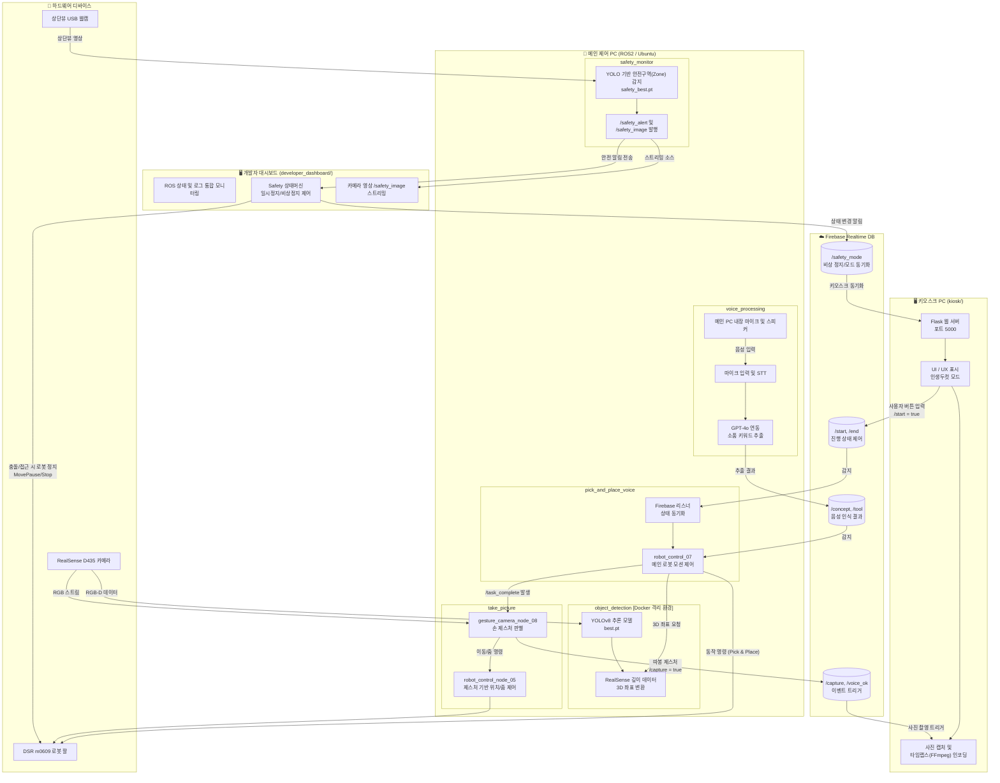

# 인생두컷 전체 시스템 플로우차트

```mermaid
flowchart TD
    subgraph KIOSK["🖥️ 키오스크 PC (kiosk/)"]
        K1["Flask 웹 서버\n포트 5000"]
        K2["UI / UX 표시\n인생두컷 모드"]
        K3["사진 캡처 및\n타임랩스(FFmpeg) 인코딩"]
        K1 --> K2 --> K3
    end

    subgraph DASHBOARD["🖥️ 개발자 대시보드 (developer_dashboard/)"]
        D1["ROS 상태 및 로그 통합 모니터링"]
        D2["Safety 상태머신\n일시정지/비상정지 제어"]
        D3["카메라 영상 /safety_image 스트리밍"]
    end

    subgraph FB["☁️ Firebase Realtime DB"]
        FB1[("/start, /end\n진행 상태 제어")]
        FB2[("/concept, /tool\n음성 인식 결과")]
        FB3[("/capture, /voice_ok\n이벤트 트리거")]
        FB4[("/safety_mode\n비상 정지/모드 동기화")]
    end

    subgraph ROS["🤖 메인 제어 PC (ROS2 / Ubuntu)"]
        subgraph RC_NODE["pick_and_place_voice"]
            RC1["robot_control_07\n메인 로봇 모션 제어"]
            RC2["Firebase 리스너\n상태 동기화"]
        end

        subgraph VP_NODE["voice_processing"]
            H4["메인 PC 내장 마이크 및 스피커"]
            VP1["마이크 입력 및 STT"]
            VP2["GPT-4o 연동\n소품 키워드 추출"]
        end

        subgraph OD_NODE["object_detection [Docker 격리 환경]"]
            OD1["YOLOv8 추론 모델\nbest.pt"]
            OD2["RealSense 깊이 데이터\n3D 좌표 변환"]
        end

        subgraph GES_NODE["take_picture"]
            GES1["gesture_camera_node_08\n손 제스처 판별"]
            GES2["robot_control_node_05\n제스처 기반 위치/줌 제어"]
        end

        subgraph SAFE_NODE["safety_monitor"]
            S1["YOLO 기반 안전구역(Zone) 감지\nsafety_best.pt"]
            S2["/safety_alert 및\n/safety_image 발행"]
        end
    end

    subgraph HARDWARE["🦾 하드웨어 디바이스"]
        H1["DSR m0609 로봇 팔"]
        H2["RealSense D435 카메라"]
        H3["상단뷰 USB 웹캠"]
    end

    %% 연결 관계
    K2 -- "사용자 버튼 입력\n/start = true" --> FB1
    FB1 -- "감지" --> RC2
    RC2 --> RC1
    
    H4 -- "음성 입력" --> VP1
    VP1 --> VP2
    VP2 -- "추출 결과" --> FB2
    FB2 -- "감지" --> RC1
    
    RC1 -- "3D 좌표 요청" --> OD2
    H2 -- "RGB-D 데이터" --> OD1
    OD1 --> OD2
    
    RC1 -- "동작 명령 (Pick & Place)" --> H1
    RC1 -- "/task_complete 발생" --> GES1
    
    H2 -- "RGB 스트림" --> GES1
    GES1 -- "이동/줌 명령" --> GES2
    GES2 --> H1
    GES1 -- "따봉 제스처\n/capture = true" --> FB3
    FB3 -- "사진 촬영 트리거" --> K3
    
    H3 -- "상단뷰 영상" --> S1
    S1 --> S2
    S2 -- "안전 알림 전송" --> D2
    D2 -- "충돌/접근 시 로봇 정지\nMovePause/Stop" --> H1
    D2 -- "상태 변경 알림" --> FB4
    FB4 -- "키오스크 동기화" --> K1
    S2 -- "스트리밍 소스" --> D3
```
