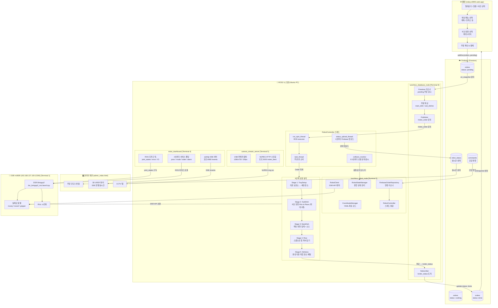

# 시스템 전체 플로우차트

```mermaid
flowchart TD
    subgraph WEB["🌐 웹앱 (rokey-d3991.web.app)"]
        W1[알레르기 / 할랄 / 비건 선택]
        W2[메인 메뉴 선택\n제육 / 돈까스 등]
        W3[서브 반찬 선택\n최대 3가지]
        W4[주문 확인 & 결제]
        W1 --> W2 --> W3 --> W4
    end

    subgraph ADMIN["🖥️ 관리자 화면 (admin_index.html)"]
        A1[주문 큐 모니터링]
        A2[3D URDF 뷰어\nSSE 관절 실시간]
        A3[CCTV 탭]
    end

    subgraph FB["☁️ Firebase (Firestore)"]
        FB1[(orders\nstatus: pending)]
        FB2[(orders\nstatus: cooking)]
        FB3[(orders\nstatus: done)]
        FB4[(robot_status\n실시간 상태)]
        FB5[(commands\n긴급 명령)]
    end

    subgraph ROS["🤖 ROS2 시스템 (Ubuntu PC)"]
        subgraph DB_NODE["lunchbox_database_node  [Terminal 3]"]
            DB1[Firestore 리스너\npending 주문 감시]
            DB2[주문 파싱\nmain_dish / sub_dishes]
            DB3[Publisher\n/robot_order 토픽]
            DB4[Subscriber\n/order_status 토픽]
        end
        subgraph ROBOT_NODE["lunchbox_robot_node  [Terminal 2]"]
            RN2[CoordinateManager\nYAML 좌표 로드]
            RN3[RobotClient\nDSR API 래퍼]
            RN4[RobotStateManager\n중앙 상태 관리]
            RN5[FirebaseOrderRepository\n명령 리스너]
            RN6[RobotController\n스레드 통합]
        end
        subgraph CTRL_THREADS["RobotController 스레드"]
            T1[ros_spin_thread\nROS executor]
            T2[task_thread\n주문 큐 소비]
            T3[status_upload_thread\n1초마다 Firebase 업로드]
            T4[collision_monitor\n0.5초마다 로봇 상태 감시]
        end
        subgraph STAGES["5단계 로봇 동작"]
            S1["Stage 1: TraySetup\n식판 보관소 → 세팅 장소"]
            S2["Stage 2: SubDish\n서브 반찬 Pick & Place (최대 3종)"]
            S3["Stage 3: MainDish\n메인 반찬 집게 + 소스"]
            S4["Stage 4: Rice\n스쿱으로 밥 퍼서 담기"]
            S5["Stage 5: Delivery\n완성 식판 픽업 장소 배달"]
            S1 --> S2 --> S3 --> S4 --> S5
        end
        subgraph DASHBOARD["robot_dashboard  [Terminal 4]"]
            D1[ROS 토픽 구독\njoint_states / error / IO]
            D2[2초마다 서비스 폴링\nposx / mode / state / alarm]
            D3[aiohttp SSE 서버\n포트 8080 /events]
        end
        subgraph CAM["camera_stream_server  [Terminal 5]"]
            C1[USB 카메라 캡처\n1280x720 / 20fps]
            C2[MJPEG HTTP 스트림\n포트 5000 /video_feed]
        end
    end

    subgraph ROBOT["🦾 DSR m0609 (192.168.137.100:12345)  [Terminal 1]"]
        R1[DSR Bringup2\ndsr_bringup2_rviz.launch.py]
        R2[실제 로봇 팔\nmovej / movel / gripper]
        R3[RViz 시각화]
    end

    W4 -- "addDoc(orders, pending)" --> FB1
    FB1 -- "on_snapshot 감지" --> DB1
    DB1 --> DB2 --> DB3
    DB3 -- "/robot_order 토픽" --> T1
    T1 --> T2
    T2 -- "Order 객체" --> STAGES
    STAGES -- "DSR API 호출" --> R2
    T3 -- "상태 업로드" --> FB4
    T4 -- "충돌 감지 모니터" --> RN4
    FB5 -- "긴급 명령" --> RN5 --> RN6
    S5 -- "완료 → /order_status" --> DB4
    DB4 -- "update status: done" --> FB3
    FB3 -- "onSnapshot 반영" --> WEB
    R1 --> R2
    R1 --> R3
    RN3 --> R2
    D1 -- "joint_states 구독" --> R1
    D2 -- "ROS 서비스 호출" --> R1
    D3 -- "SSE /events" --> A2
    C2 -- "MJPEG img src" --> A3
    FB4 -- "실시간 상태" --> A1
```
